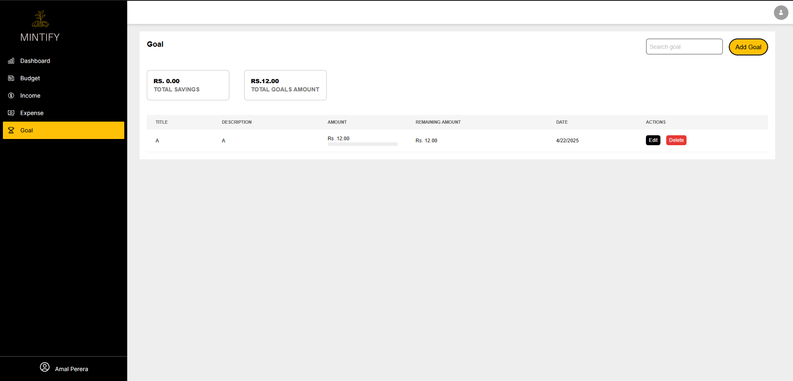

# 💰 Finance Tracker - MERN Stack Application

A simple yet powerful personal finance tracker built using **React (Vite)**, **Tailwind CSS**, and **MERN stack**. This app allows users to manage their income, expenses, budget, and savings goals efficiently.



## 🚀 Features

- 🧾 **Income Management** – Add, update, view, and delete income records.
- 💸 **Expense Tracking** – Track your daily expenses with CRUD functionality.
- 🎯 **Budget Planning** – Set and manage your monthly or weekly budgets.
- 🏦 **Savings Goals** – Define your financial goals and monitor your savings progress.

## 🛠️ Tech Stack

- **Frontend**: React (Vite), Tailwind CSS
- **Backend**: Node.js, Express.js
- **Database**: MongoDB
- **Tools**: Axios, MongoDB Atlas, Postman

## ⚙️ Getting Started

### 1. Clone the Repository

```bash
git clone https://github.com/chanukaaaa/finance-tracker.git
cd finance-tracker
```

### 2. Install Dependencies

#### For frontend:

```bash
cd client
npm install
```

#### For backend:

```bash
cd server
npm install
```

### 3. Environment Variables

Create a `.env` file in the `server` directory and add:

```
MONGO_URI=your_mongodb_connection_string
PORT=5000
```

### 4. Run the App

#### Backend:

```bash
cd server
npm run dev
```

#### Frontend:

```bash
cd client
npm run dev
```

## 📦 Folder Structure

```
finance-tracker/
│
├── client/               # React frontend (Vite)
│   ├── public/
│   └── src/
│       ├── components/
│       ├── pages/
│       └── App.jsx
│
├── server/               # Node/Express backend
│   ├── models/
│   ├── routes/
│   └── controllers/
│
├── .env
├── screenshot.png
└── README.md
```

## 📜 License

This project is open source and available under the [MIT License](LICENSE).

## ✨ Contributions

Feel free to fork this repo and submit pull requests. Let’s improve financial planning together!